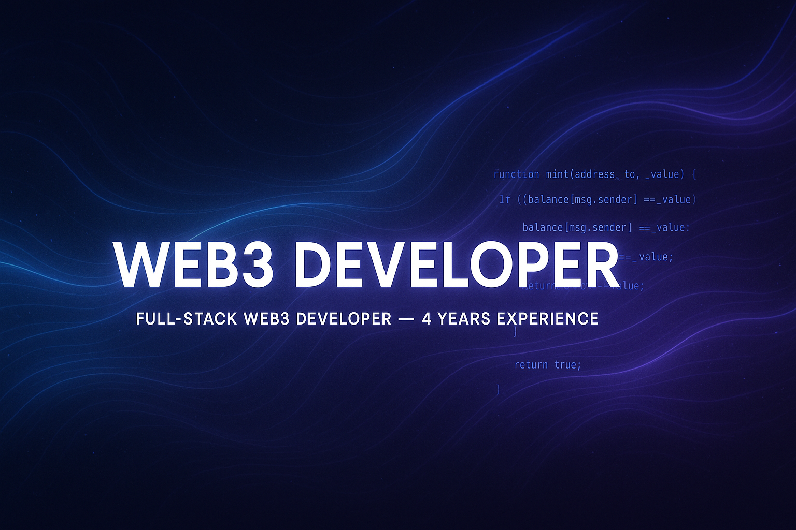

<!-- Banner -->

  

<h1 align="center">Hi 👋, I'm Alan</h1>
<h3 align="center">Full-Stack Web3 Developer • 4+ Years Experience</h3>

---

## 👨‍💻 About Me

- 🧩 Full-stack Web3 developer with **4 years experience**  
- 💻 I build **dApps, smart contracts, backend services, and modern frontends**
- ⚡ Skilled in **Solidity, Hardhat, Ethers.js, React, Node.js, Vite, Web3 integrations**
- 🤖 AI-assisted development using **ChatGPT, Claude, and automation tools**
- 🚀 Focused on clean architecture, modern tooling, and developer experience
- 🌍 Active in the **Web3, EVM, and open-source ecosystem**
- 📨 Open to collaborations and Web3 freelance work

---

## 🛠️ Tech Stack

### 🚀 Core Skills

  

### 🔗 Web3 & Blockchain

  
  

### 🤖 AI & Tools

  
  
  

---

## 📈 GitHub Stats

  
  

---

## 🚀 Featured Project

### 🪙 **ERC-20 Token Project**
A fully custom ERC-20 token written completely from scratch —  
clean, modular, dependency-free.

🔗 Repo:  
**https://github.com/alan-joshy/erc20-token**

---

<h2>🌐 Connect With Me</h2>

  
  
  
  
  

---

  🚀 <b>Building the decentralized future, one block at a time.</b>

